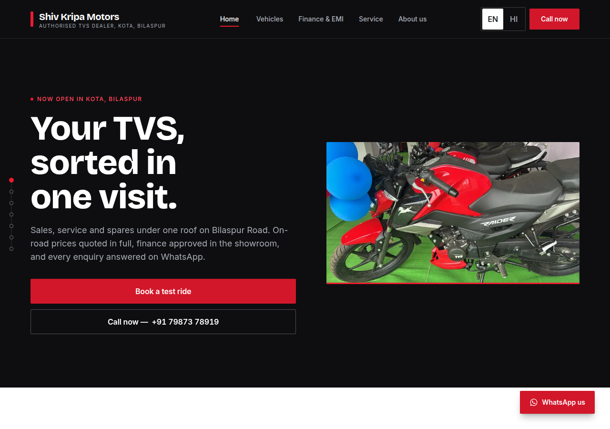
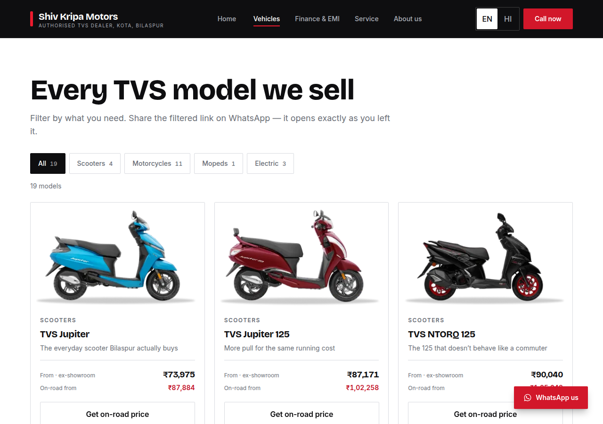

# Shiv Kripa Motors — Authorised TVS Dealer, Kota, Bilaspur

The website for a new authorised TVS two-wheeler dealership on Bilaspur Road in Kota,
Chhattisgarh. It is a working site, not a mockup: every button does what it says, the EMI
calculator does real arithmetic, and every enquiry lands in the showroom's WhatsApp.

**Some business details are still placeholders** — see
[What the dealership still has to supply](#what-the-dealership-still-has-to-supply). Everything
that is confirmed came from the owner's own photographs of the showroom signage, and every
placeholder is marked as one in `content/dealer.ts`.



---

## Running it

```bash
npm install
npm run dev          # http://localhost:3000
npm run build        # static export into ./out
```

| Script | What it does |
| --- | --- |
| `npm run build` | Next.js static export (`output: 'export'`) — no server needed |
| `npm run media` | Rebuilds `public/photos` and `public/video` from the raw uploads in `media/` |
| `npm run prepare:images` | Makes the card-sized renditions and re-indexes `public/vehicles` (runs on prebuild) |
| `npm run extract:tvs` | Reads the saved TVS pages and writes the image download list |
| `npm run download:tvs` | Downloads that list into `public/vehicles` (needs an unblocked network) |
| `npm run test:emi` | Checks the EMI maths against a hand-worked reducing-balance calculation |
| `npm run audit` | Drives the export in Chromium: 4 breakpoints, iPhone, no-JS, reduced motion, colour stage, intro, forms, i18n |
| `npm run lighthouse` | Lighthouse mobile + desktop against the export, served with Brotli. `-- --real` applies throttling instead of simulating it |
| `npm run build:hi` | The same export with Hindi as the default language, into `./out-hi` |

`npm run audit` and `npm run lighthouse` both need a built `./out`.

## Deploying

Vercel, free tier. Import the repo — `vercel.json` pins everything, so whatever the import wizard
guesses is overridden and there is no server, no database and no environment variable to set.

`vercel.json` does three things:

- **`framework: null` + `outputDirectory: out`.** This is a static export, not a served Next.js
  app. Letting Vercel use its Next.js builder produced a platform 404 at every route while the
  build itself reported success.
- **`trailingSlash: true`**, matching `next.config.mjs`, so `/finance` and `/finance/` are the
  same page rather than one of them 404ing.
- **An install command that skips Playwright's browser download**, which is a dev dependency the
  deploy has no use for and which otherwise costs minutes and disk on every build.

---

## How it is put together

### Content model

Every business fact — phone number, address, hours, prices, specs, image paths — comes from
`/content`. Nothing is hardcoded in a component, including place names: the copy files import the
dealer record, so "Kota, Bilaspur" appears everywhere from one line.

```
/content
  dealer.ts             name, address, phones, WhatsApp, hours, map, about copy
  vehicles.ts           19 models: variants, specs, colours, on-road breakdown, sources
  photos.ts             GENERATED — the dealership's own photographs and the showroom clip
  vehicle-images.json   GENERATED — the TVS photography actually present on disk
  tvs-images.json       the download list, found offline from the saved TVS pages
  copy/en.ts            English copy — also defines the `Copy` type
  copy/hi.ts            Hindi copy, typed as `Copy`
```

`hi.ts` is typed as `Copy`, so a missing or misspelled translation key is a **build error**, not a
blank space on a live page.

### Prices are sourced, and say so

Every figure in `vehicles.ts` carries the source and the date it was read, and every model page
renders those sources at the bottom. On-road totals are not typed in by hand — they come from one
formula applied identically to every model (Chhattisgarh road tax at 4% of vehicle cost, plus
HSRP, smart card and registration fees), so no two models can quietly disagree. Every price is
labelled indicative, and is meant to be replaced by the dealership's own list.

### Lead capture

Every enquiry goes to one place: the showroom's WhatsApp, with the message already written out —
model name, customer name, and the page it came from. The window opens synchronously inside the
click handler, before anything async, so it stays within the user gesture and never hits a popup
blocker.

There is deliberately no second copy. An earlier version also POSTed each lead to a form service so
there would be a record independent of the chat; the owner asked for WhatsApp only. **The tradeoff
is real: a buried or deleted chat is now a lost enquiry with nothing to fall back on.** Worth
revisiting once there is enough volume to notice.

Three fields: name, phone, model. No email — this audience does not use it.

### Bilingual

`EN | HI` in the header, persisted in `localStorage`, with `<html lang>` updated per locale. Hindi
is written natively rather than translated line by line — "EMI", "RTO", "on-road price",
"service", "showroom" and all model names stay in Latin script inside Hindi sentences, because
that is how people here actually say them.

The Hindi button is labelled "हिं" only once Hindi is the page's language. On an English page it
reads "HI", because the CSS family name matches the one `next/font` registers and setting that one
glyph in Devanagari made the browser fetch our 121KB webfont instead of the phone's own.

### Motion

`useMotionTier()` returns `'none' | 'light' | 'full'` and gates everything.

- **`none`** — the server, the first client render, `prefers-reduced-motion`, Data Saver, and 2G/3G.
  The exported HTML is the finished page: with JavaScript disabled the site is complete, not
  mid-animation.
- **`light`** (under 1280px) — section reveals, the price-sheet build, colour crossfades, the tap
  lift. One composited animation each, fired once, then unbound.
- **`full`** (1280px and up) — adds what stays bound to the scroller or the pointer: hero parallax,
  the cursor light, page wipes, and the muted showroom clip behind the hero.

Everything is transform and opacity only. Section reveals rise without fading, because copy held at
`opacity: 0` below the fold is copy that fails an automated contrast check for as long as the
animation lasts.

The opening title card mounts after hydration, so it is absent from the exported HTML and from
anything a crawler sees. It is a flat fixed panel with no image, so it cannot be measured as
Largest Contentful Paint, and it ends on the first tap, key or scroll. Shown once per session.

### Photography

Two sources, kept separate.

**The dealership's own.** The owner's photographs and clips live in `media/`, which is never
served. `npm run media` picks the chosen ones, crops and converts them into `public/photos` at four
widths with a 24px blur-up, and cuts one seven-second silent pan for the desktop hero. The
opening-ceremony portraits of individual guests are deliberately not published; only the wide shots
and the team photograph under the sign.

**TVS's official product photography**, used with the dealership's permission. Finding it and
fetching it are separate steps on purpose:

1. `scripts/fetch-tvs.mjs` renders each model page and saves the HTML — this runs on a GitHub
   runner, because the development sandbox's proxy blocks tvsmotor.com.
2. `npm run extract:tvs` reads those saved pages **offline** and writes a reviewable list of URLs.
   The first attempt did this from inside the browser and came back with 19 pages and 2 pictures,
   because its heuristics looked for absolute URLs and the site serves relative ones.
3. `npm run download:tvs` fetches that list. It has to do so from inside a real browser: the site
   sits behind a bot filter that checks the TLS handshake and session cookies, and a plain `fetch`
   with browser-shaped headers gets HTTP 403 on every URL.

Colour names come from TVS's own colour picker where it exists, and each swatch is a crop of that
colour's own photograph rather than a hand-picked hex. Sampling the hex out of the images was
confidently wrong — the Raider's red wheels made Nardo Grey come out red.

Where a model has no per-colour photograph, the stage does **not** fall back to the model's stock
photo: that showed a red Jupiter captioned "Pristine White", which is a lie a visitor cannot
detect. The row becomes a plain list of the colours the model comes in instead. A model with no
photograph at all renders a typeset plate, which is a design rather than a broken image.

---

## Verification

`npm run audit` drives the built export in Chromium and fails on any of:

- horizontal overflow at 360 / 768 / 1280 / 1600
- any tap target under 44px, or any input under 16px (which makes iOS Safari zoom on focus)
- the hero headline or primary CTA not visible with JavaScript disabled
- reveal or hero motion still running under `prefers-reduced-motion`
- a colour swatch not swapping the photograph, or not answering arrow keys
- the opening card still on screen after 1.6s, or replaying on a second page in the same session
- the whole-range rail not scrolling on a phone, or missing models
- the EMI calculator disagreeing with the reducing-balance formula
- any WhatsApp CTA without prefilled text, or a model page CTA that does not name the model
- the language toggle not persisting across navigation and reload
- a filtered `/vehicles` URL not reopening in the same state

`npm run test:emi` checks the calculator against a hand-worked calculation carried to five decimal
places — including that the "longer tenure, roughly double the interest" claim in the copy holds.

### Lighthouse

Measured against the built export, served with Brotli, on every page in both form factors.

| | Performance | Accessibility | Best Practices | SEO |
| --- | --- | --- | --- | --- |
| Mobile, simulated throttling (Lighthouse default) | **93–97** | 100 | 100 | 100 |
| Mobile, applied throttling | **93–98** | 100 | 100 | 100 |
| Desktop, simulated throttling | **100** | 100 | 100 | 100 |
| Desktop, applied throttling | **81–87** | 100 | 100 | 100 |

Accessibility is 100 on every page in every mode, which is the gate that matters and the one that
does not move.

The home page is the lowest Performance score in each row, because it is the one carrying a
photograph above the fold. Mobile home: FCP 0.8s, LCP 3.3s, CLS 0, TBT 30ms under simulation.

The two throttling modes disagree, and the desktop applied numbers are the least trustworthy
figure in the table: they are measured inside a shared CI container, where the harness's own
latency shows up as First Contentful Paint. Desktop under simulation — Lighthouse's own model of a
desktop — is 100. Both are reported rather than only the flattering one. **Re-measure on the live
URL before quoting a number.**

Three optimisations were worth more than everything else combined, and all three were one
character or one image:

| Change | Mobile home |
| --- | --- |
| Devanagari glyph in the language toggle → Latin "HI" | 79 → 86 |
| ₹ subset out of Inter and Bricolage latin-ext (101KB → 2.2KB) | 86 → 90 |
| Phone hero cropped to its displayed 4:5 at build time | 90 → 93 |

Two things were tried and reverted because the measurement said no: inlining the critical CSS, and
dropping the display font's preload.

---

## What the dealership still has to supply

All of this lives in `content/dealer.ts`, marked `PLACEHOLDER` or `UNVERIFIED`, and is a one-file
edit:

1. **Which of the two numbers receives WhatsApp.** Every enquiry on the site opens a chat with
   7987378919 — this is the single most important thing to confirm.
2. **The address line and pincode.** The signage gives "Bilaspur Road, Kota" and no more; the
   building or landmark line is blank and the pincode is inferred.
3. **Opening and closing times, and the weekly off.** Every time currently shown is invented.
4. **GSTIN.** Left `null`, so the footer omits the line rather than printing a fabricated number.
5. **The About page story, the owner's name, and the team.** The copy currently there says only
   what the photographs show and claims nothing about years in business or customers served. The
   team section renders nothing at all rather than inventing people.
6. **The dealership's own price list**, to replace the researched indicative prices.
7. **A native Hindi proofread of `hi.ts`** before go-live.
8. A logo file, if there is one separate from the TVS dealer board, into `public/brand/`.

Confirmed from the owner's own photographs of the fascia board and the opening banner, which agree
with each other: the name **Shiv Kripa Motors**, the road **Bilaspur Road, Kota**, and both phone
numbers **7987378919** and **8770639754**.

## Reviewing it

Send **a live URL, not a file**, and open it on a phone in front of the owner. There is no offline
preview bundle any more: the site is photography-led and a self-contained HTML file of it would be
several megabytes of inlined images, which is worse on the exact device it is meant to be reviewed
on.



## Deliberately out of scope

- **Google Business Profile setup and local SEO.** For a new dealership, Maps will out-perform the
  website for walk-ins in the first six months.
- A record of enquiries independent of WhatsApp. Removed at the owner's request; see
  [Lead capture](#lead-capture).
- Mobile OTP verification on enquiries — worth adding if lead quality becomes a problem, not before.
- Online booking with payment, live inventory, review collection, WhatsApp Business API automation.
- A CMS so staff can edit prices themselves.
