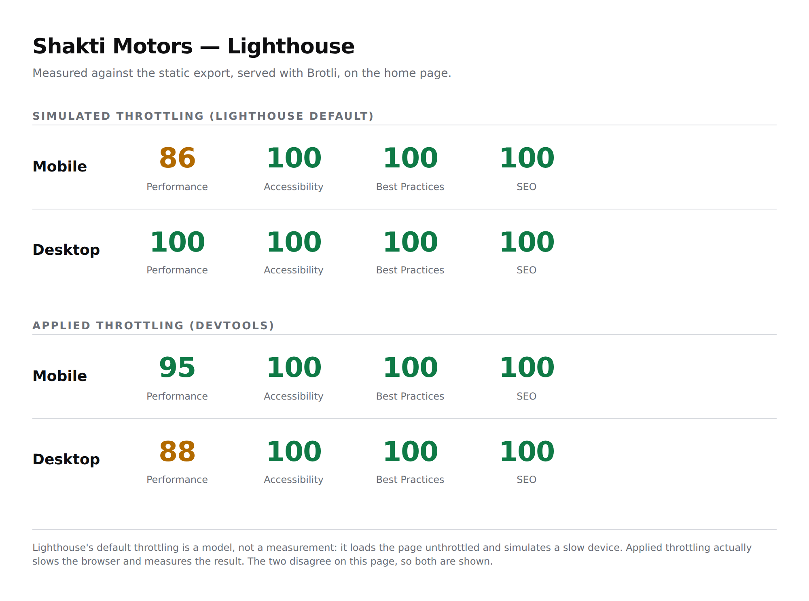

# Shakti Motors — Authorised TVS Dealer, Bilaspur

A sample/pitch site for a new authorised TVS two-wheeler dealership in Bilaspur, Chhattisgarh.
It is a working site, not a mockup: every button does what it says, the EMI calculator does real
arithmetic, and every enquiry lands in WhatsApp.

**Dealer name, phone number, address and GSTIN are placeholders.** No TVS logo, wordmark or
product photography is used anywhere — see [Brand assets](#brand-assets).



---

## Running it

```bash
npm install
npm run dev          # http://localhost:3000
npm run build        # static export into ./out
```

| Script | What it does |
| --- | --- |
| `npm run build` | Next.js static export (`output: 'export'`) — no server needed |
| `npm run gen:assets` | Regenerates the 360° stand-in frames from `content/vehicles.ts` |
| `npm run test:emi` | Checks the EMI maths against a hand-worked reducing-balance calculation |
| `npm run audit` | Drives the export in Chromium: 4 breakpoints, iPhone, no-JS, reduced-motion, spinner, forms, i18n |
| `npm run lighthouse` | Lighthouse mobile + desktop against the export, served with Brotli |
| `npm run preview` | Bundles both language builds into one self-contained `.audit/preview.html` |

`npm run audit` and `npm run lighthouse` both need a built `./out`.

## Deploying

Vercel, free tier. Import the repo and take the detected **Next.js** preset — `vercel.json` covers
the only override needed, and there is no server, no database and no environment variable the site
needs to boot.

That override exists because Vercel installs devDependencies to run the build, and Playwright's
postinstall would otherwise download ~150MB of browsers that the build has no use for. The install
command sets `PLAYWRIGHT_SKIP_BROWSER_DOWNLOAD=1`; the audit and Lighthouse scripts still work
locally, where the browser is already installed.

**Watch the branch.** Vercel deploys the repository's default branch to production. If this work is
still on a feature branch, either merge it to the default branch first, or set
*Settings → Git → Production Branch* to the feature branch. Opening a pull request also produces a
preview deployment with its own URL, which is enough for testing.

Before go-live, two values in `content/dealer.ts` must change: `formAccessKey` (a free
[Web3Forms](https://web3forms.com) key for the dealership's own inbox) and `siteUrl`.

---

## How it is put together

### Content model

Every business fact — phone number, address, hours, prices, specs, image paths — comes from
`/content`. Nothing is hardcoded in a component. When the client sends her real details it is a
one-file edit, not a hunt through the codebase.

```
/content
  dealer.ts        name, address, phone, WhatsApp, hours, map embed, GSTIN, form key
  vehicles.ts      9 models: variants, specs, colours, on-road breakdown, render geometry, sources
  copy/en.ts       English copy — also defines the `Copy` type
  copy/hi.ts       Hindi copy, typed as `Copy`
```

`hi.ts` is typed as `Copy`, so a missing or misspelled translation key is a **build error**, not a
blank space on a live page.

### Prices are sourced, and say so

Every figure in `vehicles.ts` carries the source and the date it was read, and every model page
renders those sources at the bottom. On-road totals are not typed in by hand — they come from one
formula applied identically to every model (Chhattisgarh road tax at 4% of vehicle cost, plus HSRP,
smart card and registration fees), so no two models can quietly disagree. Every price is labelled
indicative.

### Lead capture

Every form submits twice, from a single tap:

1. **POST to Web3Forms**, so there is a permanent record even if a WhatsApp thread gets buried.
2. **A WhatsApp deep link** with the enquiry already written out — model name, customer name, and
   the page it came from.

The WhatsApp window is opened synchronously inside the click handler, before any `await`, so it is
still within the user gesture and never hits a popup blocker. The POST runs with `keepalive` so it
completes even as the browser hands off to the WhatsApp app. If the POST fails, the confirmation
still shows — the message has already gone, and a failed POST costs the record, not the lead.

Three fields: name, phone, model. No email — this audience does not use it. No OTP in v1; see
[Roadmap](#deliberately-out-of-scope-for-v1).

### Bilingual

`EN | हिं` in the header, persisted in `localStorage`, and `<html lang>` updated per locale.
Hindi is written natively rather than translated line-by-line — "EMI", "RTO", "on-road price",
"service", "showroom" and all model names stay in Latin script inside Hindi sentences, because that
is how people in Bilaspur actually say them.

Inter and Bricolage Grotesque are Latin-only, so Hindi is set in Noto Sans Devanagari, which is
**not** preloaded: it is 121KB and an English visitor never renders a glyph from it.

### Motion

One hook, `useReducedExperience()`, gates the entire desktop motion layer. It returns `true` —
meaning "render the finished static state" — for viewports under 1280px, for
`prefers-reduced-motion: reduce`, for Data Saver, and for 2G/3G. It also returns `true` on the
server and on first paint, so **the exported HTML is the finished page**: with JavaScript disabled
the site is complete, not mid-animation.

| | Desktop ≥1280px | Phone / reduced motion |
| --- | --- | --- |
| Hero | Assembles on load and on scroll, parallax between layers, cursor-tracked lighting | One rise on load, no scroll binding |
| 360° spinner | 36 frames, drag or trackpad-scrub | 12 frames; static image + swatches on Data Saver / 2G |
| Sections | Rise with a 40–80ms stagger | Static |
| Price sheet | Rows reveal top to bottom, total counts up | Static, total counts up |
| Smooth scroll, progress rail, magnetic CTAs, page wipe | Yes | No |
| EMI number roll | Yes | Yes |

Constraints held throughout: `transform` and `opacity` only, never layout properties; no rAF loop
runs while idle or off-screen; everything unbinds on unmount; all timings 200–600ms. Motion is
absent from `/service`, from the finance inputs, and from every form — where the visitor is doing
work, the interface holds still.

Two deliberate deviations from the brief, both to keep Accessibility at 100:

- **Section reveals rise without fading.** Copy held at `opacity: 0` while it waits below the fold
  is copy that fails an automated contrast check for as long as it waits.
- **The hero headline rises without fading** for the same reason. The fade is kept on the hero
  vehicle, which is artwork and has nothing to read.

### Design

Red is rationed and black carries the weight: large calm dark surfaces, generous whitespace,
alternating dark and light sections, and red only where action or price emphasis lives.

`#EC1B2E` is the brand red and appears on every non-text surface — the scroll rail, hairlines, the
active-nav underline, focus rings. As text, or behind white text, it measures 4.4:1, just under the
4.5:1 floor, so two tuned siblings carry those jobs (`--tvs-red-cta`, `--tvs-red-on-ink`,
`--tvs-red-on-light`). To the eye they are the same red; to a contrast checker they are not.

The signature object is the **on-road price sheet** — a receipt with hairline rules, tabular
numerals, and ex-showroom / RTO / insurance / accessories stacking to a bolded red total. It appears
on every model page and in miniature on the homepage.

---

## Brand assets

No TVS logo, wordmark or product photography is used. TVS enforces Corporate Identity norms on
dealer signage and branding, and the real assets come from the dealership's brand pack after
appointment.

### The vehicle visuals are stand-ins built to the render specification

`scripts/generate-vehicle-frames.mjs` produces the 360° sequences from the real vehicle dimensions
in `content/vehicles.ts` — wheelbase, overall length, height and wheel diameter — so the
proportions are true to the machines rather than generic. They are generated to the **exact
specification the finished renders will be commissioned to**:

- 36 frames per colour, orbiting at 10° intervals
- camera fixed at 15° elevation, locked focal length, locked exposure
- neutral studio, dark ground matching `--ink`, key light upper front-left, rim light behind
- one sequence per official body colour
- 2000 × 1200px canvas, identical aspect ratio for every model
- every frame well under the 40KB per-frame limit (largest is ~10KB)

```
/public/vehicles/<slug>/<colour-slug>/frame-00.svg … frame-35.svg
```

Because the dimensions, framing, angles and file naming match the commission spec, **dropping the
finished renders into those folders is a file replacement — no code change, no layout change,
nothing reflows.** Every image path resolves from `vehicles.ts`.

### Asset pipeline, in priority order

1. **The official TVS dealer brand pack** — approved photography, logos, colour codes. Correct,
   free, and the right thing to ask the client for.
2. **Photograph the showroom stock** — once vehicles are on the floor. Mark a circle on the floor,
   bike in the centre, 36 frames at 10° intervals, tripod, fixed exposure. The client owns these
   outright and real local inventory beats stock photography for trust. Billable.
3. **Properly licensed stock** (Unsplash, Pexels) for generic supporting imagery only — showroom,
   service bay, road scenes. Never as a stand-in for a specific model.
4. **Commissioned photoreal 3D renders** — the chosen direction. Work-for-hire, so they are owned
   outright, carry no licensing risk, can be produced in any colour and any angle, and give the
   spinner perfect frames. Start with two or three models to prove the pipeline before spending on
   all nine. Price it into the quote as an asset production charge; the renders stay reusable across
   print, signage and social.

Nothing here scrapes TVS product photography, press images, or third-party 3D models. The cost of
getting that wrong is the account, not just the asset.

---

## Verification

`npm run audit` drives the built export in Chromium and fails on any of:

- horizontal overflow at 360 / 768 / 1280 / 1600
- any tap target under 44px, or any input under 16px (which makes iOS Safari zoom on focus)
- the hero headline or primary CTA not visible with JavaScript disabled
- hero layers still partly transparent under `prefers-reduced-motion`
- the 360° spinner not responding to mouse drag, touch drag, arrow keys, or a colour swap
- the EMI calculator disagreeing with the reducing-balance formula
- any WhatsApp CTA without prefilled text, or a model page CTA that does not name the model
- the language toggle not persisting across navigation and reload
- a filtered `/vehicles` URL not reopening in the same state

`npm run test:emi` checks the calculator against a hand-worked calculation carried to five decimal
places — including that the "longer tenure, roughly double the interest" claim in the copy actually
holds.

### Lighthouse

| | Performance | Accessibility | Best Practices | SEO |
| --- | --- | --- | --- | --- |
| Mobile, simulated throttling (Lighthouse default) | **86** | 100 | 100 | 100 |
| Mobile, applied throttling | **95** | 100 | 100 | 100 |
| Desktop, simulated throttling | **100** | 100 | 100 | 100 |
| Desktop, applied throttling | **88** | 100 | 100 | 100 |

**Mobile Performance does not hit the 95 target under Lighthouse's default throttling.** That
default is a model, not a measurement: Lighthouse loads the page unthrottled and then simulates a
1.6 Mbps / 150ms / 4×-CPU device. Under applied throttling — the same conditions actually imposed on
the browser — the same page measures FCP 1.8s, LCP 1.8s, CLS 0, TBT 200ms, and scores 95. The gap is
entirely in the simulated LCP, which the throttled browser does not reproduce. Both numbers are
reported above rather than only the flattering one; the field metrics should look like the second
row, but this is worth re-measuring on the live Vercel URL before quoting a number to the client.

Accessibility is 100 on every page in every mode. Total JS is ~130KB raw, ~45KB compressed.

---

## What to send the client

Send **a live URL, not a file.** Open it on her phone, in front of her.

1. This is a working site, not a picture — every button does what it says.
2. Every enquiry lands directly in your WhatsApp, so you can reply from the showroom floor.
3. Once your dealership is appointed, TVS will give you a brand pack — approved logos, model
   photography, colour codes. **Send me that pack and I'll drop it straight in.** The site is
   already built to receive it, so nothing needs rebuilding.
4. The vehicle visuals you're seeing now are stand-ins built to the exact dimensions of the final
   renders — the swap is a file change, not a redesign.

Then ask one question and stop talking: *"What would you change?"*

## Deliberately out of scope for v1

Worth naming so the roadmap has somewhere to go:

- **Google Business Profile setup and local SEO.** Mention this first. For a new dealership in
  Bilaspur, Maps will out-perform the website for walk-ins in the first six months — offering to set
  it up shows you are solving her problem rather than selling her a website.
- Mobile OTP verification on enquiries. TVS's own booking flow uses it; worth adding if lead quality
  becomes a problem, not before.
- Online booking with payment
- Inventory availability
- Customer review collection — starts making sense at roughly three months
- WhatsApp Business API automation
- A CMS so her staff can edit prices themselves
